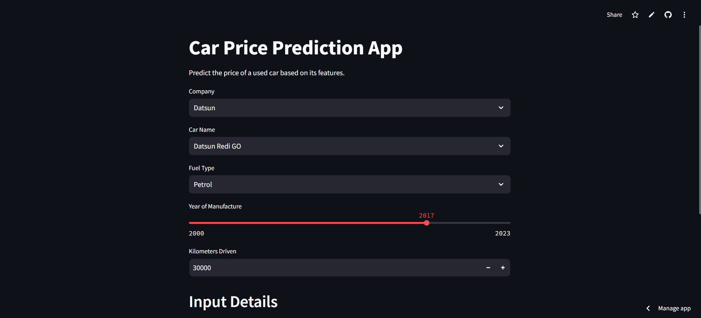
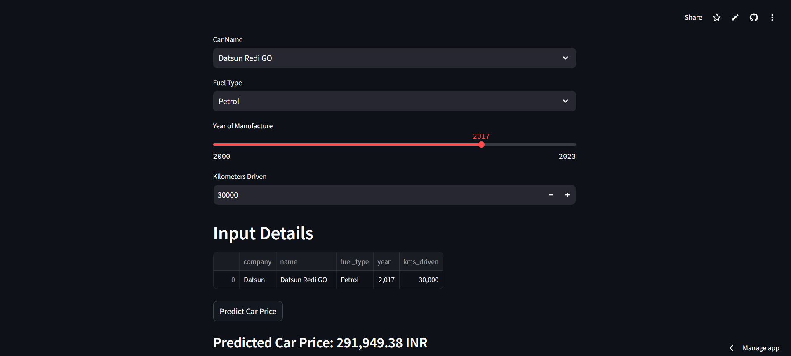

## Project Title

**Car Price Prediction**

## Overview

This project presents a Car Price Prediction model using Machine Learning techniques. The application predicts the selling price of used cars based on various features, providing users with an estimated value for their vehicles. The project utilizes advanced data preprocessing, feature engineering, and regression algorithms to achieve accurate predictions.

## Recommendation Workflow

- **Data Collection:** Gathered historical data from online car sales platforms.
- **Data Preprocessing:** Cleaned the dataset by handling missing values, outliers, and categorical variables.
- **Feature Engineering:** Created new features and transformed existing ones to improve model performance.
- **Model Training:** Trained various regression models, including Linear Regression, Random Forest, and Gradient Boosting.
- **Deployment:** Developed a user-friendly interface with Streamlit for real-time price predictions.

## Key Features

- User-friendly web interface for inputting car details.
- Real-time price prediction with result display.
- Visualizations of model performance and feature importance.
- Robust preprocessing techniques to ensure data quality.

## Parameters

- Model Selection: Included multiple regression models to compare performance and select the best one.
- Hyperparameter Tuning: Optimized model parameters using techniques such as Grid Search and Cross-Validation.

## Key Insights

- The model accurately predicts car prices based on input features.
- Feature engineering significantly contributes to the model's predictive power, especially with categorical variables

## Usage
- Run the Streamlit application: - streamlit run app.py
- Enter a message in the input box and click "Predict" to see the classification result.

## Files Descriptions
- app.py: Main Streamlit application file for the prediction interface.
- Linear Regression Model.pkl: Pickled regression model used for car price predictions.
- Cleaned car.csv: Cleaned dataset used for model training.
- requirements.txt: List of Python packages required for the project.

## Technologies Used

- Python: Programming language used for developing the model and application.
- Streamlit: Framework for creating web applications.
- scikit-learn: Library for machine learning algorithms and utilities.
- Pandas: Library for data manipulation and analysis.
- NumPy: Library for numerical operations.

## Link to Web App

https://car-price-prediction-model-6x4qggibigvnv82vk87vl4.streamlit.app/

## Visuals

## Results and Recommendations
The car price prediction model has shown promising results, accurately predicting prices with a low error margin. It is recommended to further enhance the model by:

- Incorporating additional features like market demand indicators.
- Utilizing more extensive datasets for training.

## Conclusion

This Car Price Prediction project demonstrates the practical application of machine learning techniques for real-world problems. The integration of a Streamlit interface allows for easy interaction, making it accessible for users looking to estimate the selling price of their vehicles quickly.
